# 🧠 FórumHub - API REST com Spring Boot


FórumHub é uma API REST desenvolvida com Spring Boot que simula o backend de um fórum de discussão. 
O projeto cobre desde o cadastro e gerenciamento de tópicos até autenticação segura com JWT, seguindo boas práticas de desenvolvimento e arquitetura.

---

## 🎯 Objetivo do Projeto

Criar uma API REST para gerenciamento de tópicos de um fórum, permitindo operações de CRUD (criar, listar, atualizar, excluir) com controle de acesso via autenticação JWT. 
O projeto visa aplicar boas práticas com Spring Boot, JPA, validações, migrações com Flyway e segurança com Spring Security.

---

## 🛠️ Tecnologias Utilizadas

- **Java 17+**
- **Spring Boot**
- **Maven**
- **MySQL** ou **PostgreSQL**como banco de dados
- **Flyway** para versionamento de migrations
- **Spring Data JPA** para persistência
- **Spring Web** para criação de endpoints REST
- **Spring Security** para autenticação
- **JWT (JSON Web Token)** para controle de acesso
- **Lombok** para reduzir boilerplate
- **Validation** para validação de dados
- **DevTools** para hot reload durante o desenvolvimento

---

## ⚙️ Configuração do Ambiente

1. Instale o Java 17 ou superior.
2. Configure o Maven (versão 4).
3. Crie o projeto com Spring Initializr e adicione as dependências:
   - `Lombok`
   - `Spring Web`
   - `Spring Boot DevTools`
   - `Spring Data JPA`
   - `Flyway Migration`
   - `MySQL Driver`
   - `Validation`
   - `Spring Security`
4. Configure o `application.properties` com as credenciais do banco e parâmetros do JWT:

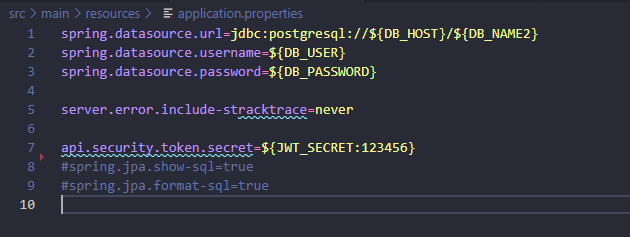

---

## 📚 Funcionalidades da API

### 1. Cadastro de Tópico
- **Endpoint:** `POST /topicos`
- **Requisição:** JSON com `título`, `mensagem`, `autor` e `curso`
- **Validação:** Todos os campos obrigatórios (`@Valid`)
- **Regra de negócio:** Não permitir tópicos duplicados (mesmo título e mensagem)

### 2. Listagem de Tópicos
- **Endpoint:** `GET /topicos`
- **Resposta:** JSON com `título`, `mensagem`, `data de criação`, `status`, `autor` e `curso`
- **Extras:**
  - Ordenação por data (ASC)
  - Filtro por nome do curso e ano
  - Paginação com `@PageableDefault`

### 3. Detalhamento de Tópico
- **Endpoint:** `GET /topicos/{id}`
- **Validação:** Verificar se o ID existe (`Optional.isPresent()`)

### 4. Atualização de Tópico
- **Endpoint:** `PUT /topicos/{id}`
- **Validação:** Verificar existência do ID e aplicar regras de negócio do cadastro

### 5. Exclusão de Tópico
- **Endpoint:** `DELETE /topicos/{id}`
- **Validação:** Verificar existência do ID antes de usar `deleteById`

---

## 🔐 Autenticação e Segurança

### 1. Login
- **Endpoint:** `POST /login`
- **Requisição:** JSON com `login` e `senha`
- **Resposta:** Token JWT

### 2. Geração de Token
- Criar classe `TokenService` com método `gerarToken()` usando algoritmo **HMAC256**
- Configurar expiração e segredo via `application.properties`

### 3. Controle de Acesso
- Criar filtro/interceptor para validar token em cada requisição
- Proteger endpoints de tópicos (CRUD)
- Retornar erros apropriados (`401`, `403`) em caso de token inválido

---

## 🧪 Testes da API

### Ferramentas recomendadas
- [Postman](https://www.postman.com/)
- [Insomnia](https://insomnia.rest/)

### Testar
- Cadastro, listagem, atualização e exclusão de tópicos
- Login e recebimento de token
- Requisições autenticadas com header: Authorization: Bearer token

---

### 🧪 Roteiro de Testes da API FórumHub

Antes de realizar qualquer operação nos endpoints de tópicos, é necessário autenticar-se. Caso contrário, a API retornará erro de acesso negado (`403 Forbidden`). Abaixo está o passo a passo para testar cada funcionalidade da API:

---

#### 🔐 Autenticação

Antes de tudo, tente fazer o cadastro de um novo tópico sem autenticação. A requisição será negada com erro `403`: isso ocorre por falta de permissões ou ausência do token JWT. Para resolver isso, é necessário realizar o login com um usuário válido e existente no banco de dados.

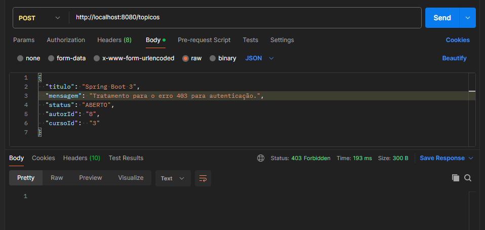

- **Endpoint de login:** `POST /login`
- Envie um JSON com `login` e `senha` válidos.
- Se as credenciais estiverem corretas, será gerado um token JWT temporário.
- Copie esse token e cole no cabeçalho de todas as requisições protegidas (`POST`, `PUT`, `DELETE`) no formato:

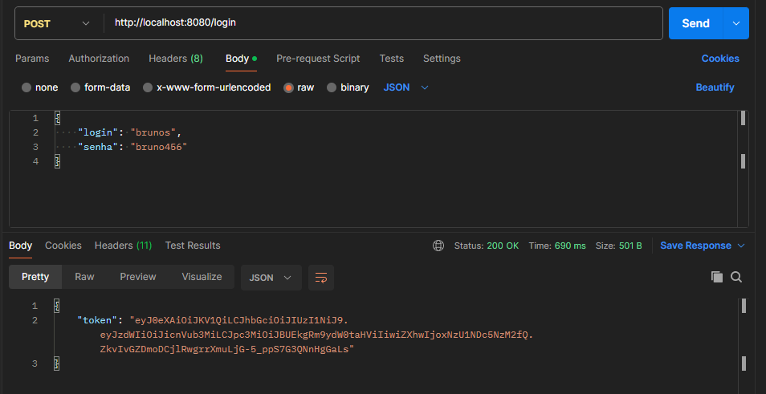

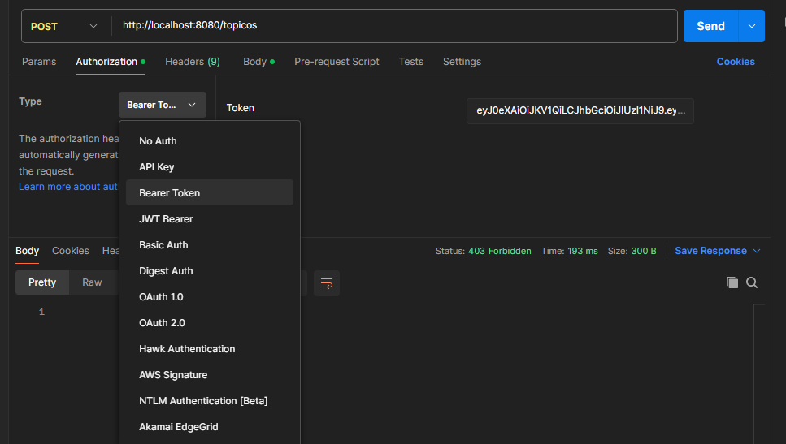

---

#### 📝 Cadastro de Tópico

Após autenticar-se e obter o token, você pode realizar o cadastro de um novo tópico.

- **Endpoint:** `POST /topicos`
- Envie um JSON com os campos obrigatórios: `titulo`, `mensagem`, `autor` e `curso`.
- A API validará os dados e impedirá o cadastro de tópicos duplicados (mesmo título e mensagem).
- Se tudo estiver correto, o tópico será criado com sucesso (`201 Created`).

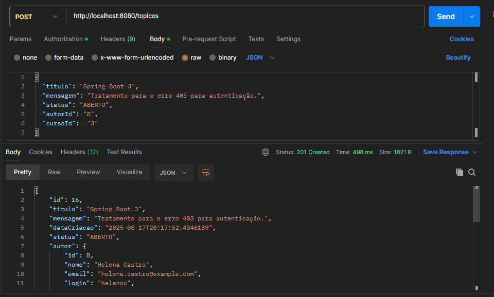

---

#### 📋 Listagem de Tópicos

Com o token no cabeçalho, você pode listar todos os tópicos cadastrados.

- **Endpoint:** `GET /topicos`
- A resposta será um JSON com os dados dos tópicos: `titulo`, `mensagem`, `data de criação`, `status`, `autor` e `curso`.
- É possível aplicar ordenação por data (ASC), filtros por nome do curso e ano, além de paginação com `@PageableDefault`.

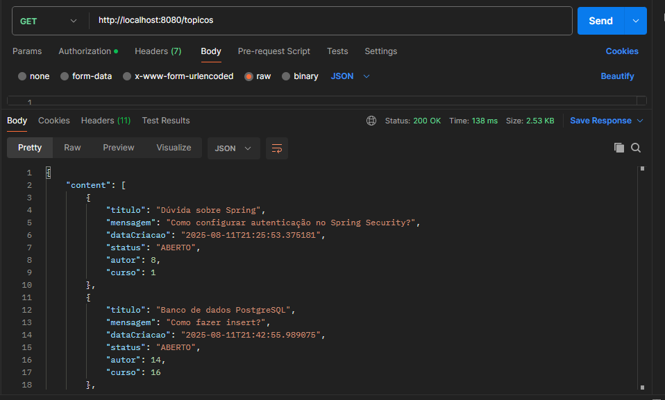

---

#### 🔍 Detalhamento de Tópico por ID

Para visualizar os detalhes de um tópico específico:

- **Endpoint:** `GET /topicos/{id}`
- A API verificará se o ID existe. Caso contrário, retornará erro `404 Not Found`.

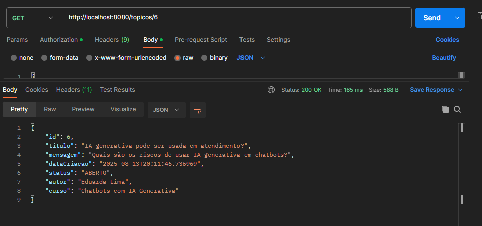

---

#### ✏️ Atualização de Tópico

Para atualizar um tópico existente:

- **Endpoint:** `PUT /topicos/{id}`
- Envie um JSON com os campos atualizados.
- A API validará o ID e aplicará as regras de negócio do cadastro.
- Se o ID for válido, o tópico será atualizado com sucesso (`200 OK`).

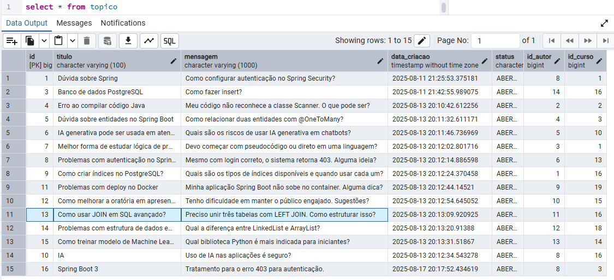

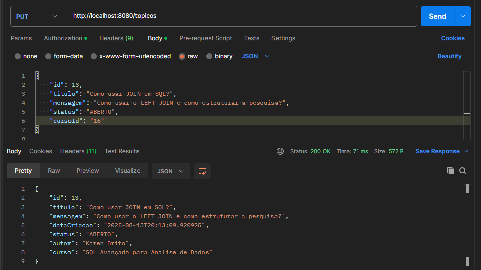

---

#### 🗑️ Exclusão de Tópico

Para excluir um tópico:

- **Endpoint:** `DELETE /topicos/{id}`
- A API verificará se o ID existe antes de executar `deleteById`.
- Se o ID for válido, o tópico será removido (`204 No Content`).

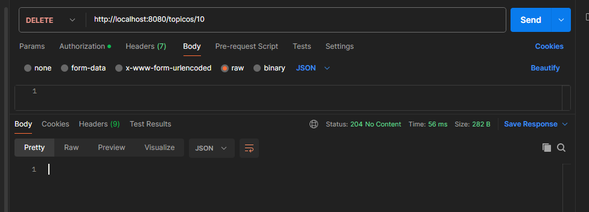

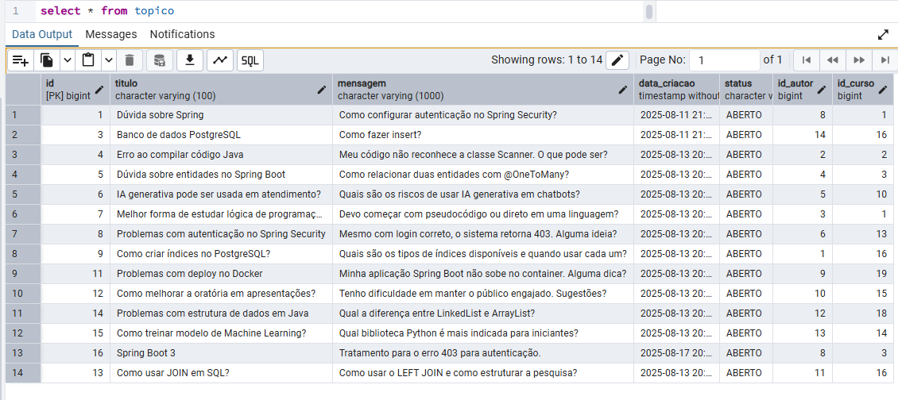

---

## ⚠️ Dificuldades e Desafios

- **Validação de dados:** Garantir que todos os campos obrigatórios sejam preenchidos corretamente
- **Evitar duplicidade:** Impedir cadastro de tópicos com mesmo título e mensagem
- **Autenticação segura:** Configurar corretamente o Spring Security e JWT
- **Controle de acesso:** Implementar filtros para proteger endpoints
- **Migrations:** Gerenciar alterações no banco com Flyway sem corromper dados existentes

---

## 🚀 Como Executar o Projeto

### 1. Clone o repositório
```bash
git clone https://github.com/NayaraCalixto/forum-hub


## 👨‍🏫 Instrutores
- Rodrigo Ferreira


## 🚀 Projeto do Curso Java One
Este projeto faz parte do desafio proposto no curso <strong>Java One</strong>, com o objetivo de consolidar os aprendizados iniciais em Java através da criação de um sistema prático e funcional.

